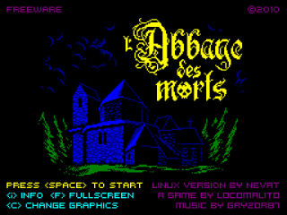
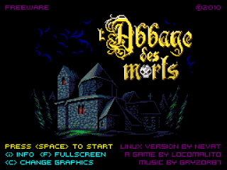
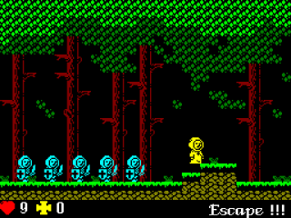
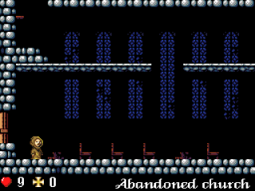

# Abbaye-SDL

Cross-platform port of the indie game *l'Abbaye des Morts*, it uses C language with SDL2
libraries.

## Media / Screenshots

## Platforms

Currently, this port works on:

 * GNU/Linux (32 & 64 bits), including Raspberry Pi
 * FreeBSD
 * Mac (must specify PLATFORM=mac to make commands)
 * OpenPandora
 * CGW Zero
 * Nintendo Wii
 * PSP [Link](https://t.co/AkH3HvG3kr)
 * XBox [Link](https://t.co/rLwe4UCi43)
 * Nintendo 3DS (replaced SDL2) [Link](https://github.com/JeffRuLz/abbayedesmorts-3ds)

Feel free to port this program to other systems. It is open source, take the code and
modify it to fit your platforms needs!

## Installation from source

Under GNU/Linux and FreeBSD, in order to compile this program, you need to
install SDL2, SDL2_image and SDL2_mixer libraries. Check your distribution
instructions on how to install them.

For example, on Fedora:

    sudo dnf install SDL2-devel SDL2_image-devel SDL2_mixer-devel

And on Debian:

    sudo apt-get install libsdl2-dev libsdl2-image-dev libsdl2-mixer-dev

Now we can proceed to the main build:

    tar xf abbaye-<version>.tar.gz # unpack the source code file (or download from Github)
    cd abbaye-<version>            # enter the directory
    make                           # build the game executable
    make install                   # install the game (as root)

An icon will appear in your application menu, in game section.
Alternatively you can run the game with `abbayev2`.

### Mac installation

To build on Macs, we use Homebrew as the package manager for dependencies. Note that we must specify `PLATFORM=mac` to the make commands

    brew install SDL2 SDL2_image SDL2_mixer
    tar xf abbaye-<version>.tar.gz # unpack the source code file (or download from Github)
    cd abbaye-<version>            # enter the directory
    make PLATFORM=mac              # build the game executable
    sudo make install PLATFORM=mac # install the game (as root)

## Uninstallation from source

    cd abbaye-<version> # enter the directory
    make uninstall      # uninstall the game (as root)

## Command line parameters

* `-nofilter`: disable linear filtering on screen image.
* `-fullscreen`: start the game in fullscreen.
* `-graphset`: start the game using the 16-bit graphics set.

Note that the last two can be changed in-game with the `F` and `C` keys, respectively.

## History

[Abbaye des Morts](https://www.locomalito.com/abbaye_des_morts.php) is a freeware game
made by LocoMalito (with the help of Gryzor87 for Music and FX) in 2010. It was developed
with Gamemaker and only runs natively in Microsoft Windows systems.

This is a port to GNU/Linux systems and any system that supports C and SDL libraries.

The version 2.0 of the game is a port from SDL1.2 to SDL2 libraries. This includes a nice
set of features: OpenGL rendering, auto-scaling, Android & IOS support, VSync, etc.

## License

The code is licensed under the GNU GPL version 3, see COPYING file for reference. Anyone
can download, see, change and redistribute the code.
The Graphics and Sounds have been released under the CC-BY-3.0 license.
